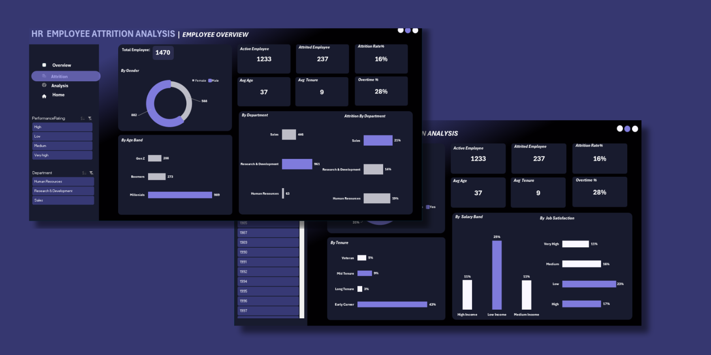
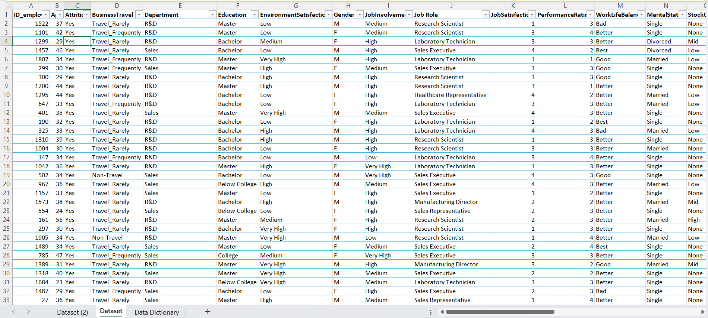
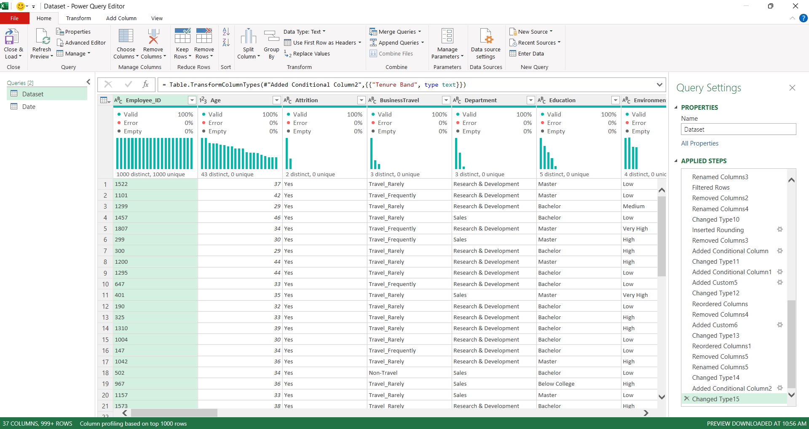
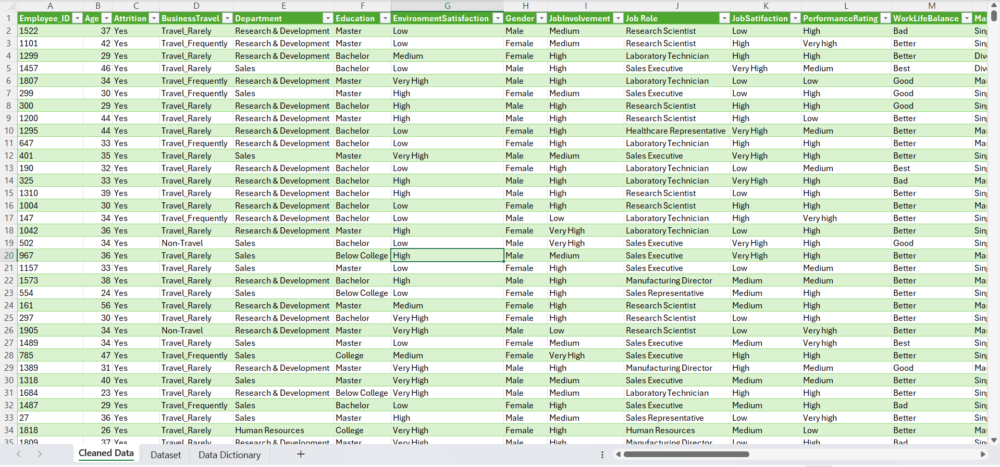
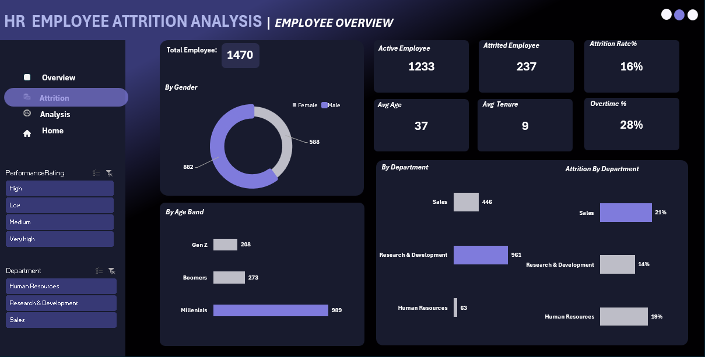
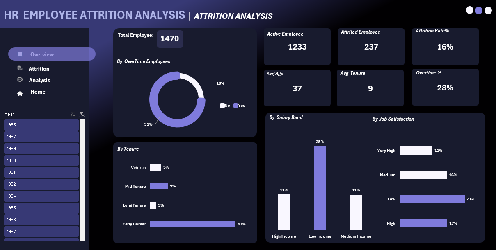

# TDI-HR-ANALYSIS-DASHBOARD

## Dashboard Preview

---

# HR Dataset Documentation

## PROJECT OVERVIEW:

When Daniel, the new HR Manager, joined the TDI, he noticed something unusual employees were leaving more often than expected.

At first, leadership assumed it was normal turnover. But within a few months, resignations started affecting productivity, projects slowed down, and teams became understaffed.

Instead of guessing the cause, Daniel decided to dig into the company's HR data.

I assumed as a Data Analyst Intern for The Data Immersed (TDI). TDI is seeking deeper insights into employee attrition at an organization to help improve retention strategies and enhance employee satisfaction.

Your role is to design an HR Employee Attrition Analysis Dashboard in Microsoft Excel that will identify trends, assess factors contributing to attrition, and support decision-making for employee retention policies.

---

# BUSINESS PROBLEM:

TDI is experiencing "leaky bucket" syndrome, hiring talent only to lose them within a short period (Employee attrition: staff leaving the organization) but lacks visibility into:

- Who is leaving  
- Why they are leaving  
- Which departments or employee groups are most affected  
- What HR actions can reduce turnover  

Without this insight, the organization risks:

- Increased recruitment & onboarding costs  
- Loss of experienced talent  
- Reduced productivity & morale  
- Poor workforce planning  

---

# BUSINESS OBJECTIVES:

Develop an HR Attrition Analysis Dashboard that will:

1. Identify drivers of attrition  
2. Detect high-risk employee segments  
3. Support data-driven retention strategies  
4. Help HR allocate investments effectively  

---

# DATA CLEANING AND TRANSFORMATION

## STEP 1
Imported the HR Data into Power Query.

## STEP 2: DATA CLEANING IN POWER QUERY

1. Checked and removed all duplications from the employee id column.  

2. Standardize Column Names  
(Id_employee to EmployeeID, MonthlyRate to MonthlyIncome).

3. Convert Date Columns to Proper Format  
(Departure Date, HireDate)

4. Handle Missing Values  

Did not replace the blanks with 0.

Created a conditional column instead:

IsActive = if [DateofTermination] = null then 1 else 0  

Or  

IsTerminated = if [DateofTermination] = null then 0 else 1  

5. Changed the abbreviated records  
(R&D into Research & Development) for better understanding.

6. Changed the short form on the gender column into an understandable records format  
(M to Male, F to Female)

7. Changed the 1,2,3,4 on performanceRating and JobSatisfacton column to a more understandable format  
(Low, Medium, High and Very Low).

8. Created new columns to calculate the tenure

Tenure = (DepartureDate – HireDate) / 365

9. Grouped the age, salary and Tenure into bands.

Age Band  
IF age >= 27, "Genz" else if age >=45, "Millenials", "Boomers"

Salary Band  
IF (Salary<3000,"Low", else if(Salary<7000,"Medium","High"))

---

---

# KEY METRICS WORKED ON

1. Total Employee_Id

DISTINCTCOUNT('Dataset'[Employee_ID])

2. Active Employee

CALCULATE ([Total Employee], 'Dataset'[Attrition] = "No")

3. Terminated Employee

CALCULATE ([Total Employee], 'Dataset'[Attrition] = "Yes")

4. Attrition Rate

DIVIDE([Terminated], [Total Employee])

5. Average Salary

AVERAGE('Dataset'[Salary])

6. Average Age

AVERAGE([Age])

7. Average Tenure

AVERAGE('Dataset'[Tenure])

8. Overtime %

DIVIDE ([Overtime Employee],[Total Employee])

---

# DASHBOARD FEATURES

## PAGE 1: EMPLOYEE OVERVIEW

KPIs:

Total Employee: 1470  
Active Employee: 1233  
Attrited Employee: 247  
Attrition Rate: 16%  
Average Age: 37  
Average Tenure: 9  
OverTime Rate: 28%

Employee Headcount

- By Gender  
- By Department  
- By Age band  
- Attrition by Department  

---

## PAGE 2: ATTRITION ANALYSIS

Attrition:

- By Overtime  
- By Tenure  
- By Salary Band  
- By Job Satisfaction  

---

# INSIGHTS

1. The workforce is male dominated, with males representing 882 (approximately 60%) of employees, while females (588) account for 40%.

2. The Research & Development department represents the largest workforce segment (961), the sales account (446) and the Human resources had the least employee count (63).

3. The Sales department experience the highest attrition rate (21%), Human Resources (19%) and Research and development (14%), this suggesting a strong possible challenge such as job pressure, performance targets, compensation dissatisfaction or lack of career development.

4. Employees in the low-income salary band has an attrition rate of (25%) while the middle- and high-income earners have 11%.

5. Attrition is highest among employees with low job satisfaction, demonstrating a clear link between employee engagement and retention.

6. Employees who frequently work overtime are three times more likely to leave, indicating that workload imbalance or burnout may contribute significantly to attrition.

---

# RECOMMENDATIONS

1. Improve Compensation for Low-Income Employees  

HR should review compensation structures and provide competitive salary adjustments, particularly for entry-level employees, to reduce attrition.

2. Reduce Overtime Workload  

Implement workload balance strategies, flexible schedules, or additional staffing to minimize excessive overtime and reduce employee burnout.

3. Address Employees Concern  

Introduce and Invest in training Programs and Career progression plans.

4. Improve Retention Strategies  

Formulate effective retention strategies such as focusing on improving work cultures, management practices and offering competitive benefits to retain talents.
